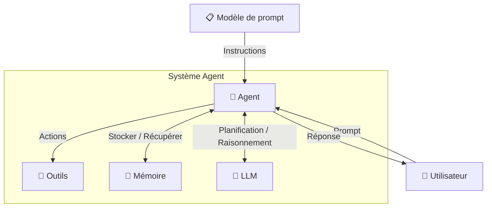
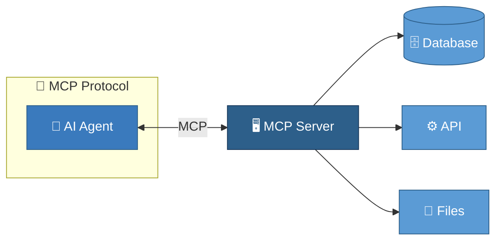

# 🤖 Workflows Agentiques

> 🚀 **Atelier Pratique IANA 2026** (IA en Nouvelle Aquitaine)  
> *Passer du No-Code à l'échelle industrielle avec MCP et Otoroshi-LLM*

Ce répertoire contient toutes les ressources, codes sources et guides pas-à-pas pour suivre et reproduire les exercices de l'atelier.

---

### 🗺️ Déroulement de l'Atelier

L'atelier est structuré en trois grandes étapes progressives :

* **[Concept] Partie 1 : Contexte**  
  Une introduction générale sur les concepts d'**agents IA** et sur la nécessité d'introduire des standards de communication universels comme le protocole **MCP** pour étendre leurs fonctionnalités.
* **[No-Code / Low-Code] Partie 2 : [iana-n8n](./iana-n8n)**  
  Mise en œuvre pratique avec le framework **n8n** pour créer rapidement des agents conversationnels et les connecter à des services tiers (RAG local) via MCP, **sans écrire une seule ligne de code**.
* **[Production / Industrie] Partie 3 : [iana-otoroshi](./iana-otoroshi)**  
  Industrialisation dans un contexte d'entreprise pour **exposer et sécuriser** des agents et des services MCP grâce à la puissance d'**Otoroshi** et de son extension LLM (gestion d'API, sécurité, budgets, observabilité, guardrails).

---


## 📋 Sommaire

- [Partie 1 : Contexte](#partie-1--contexte)
  - [De l'IA Générative à l'IA Agentique](#de-lia-générative-à-lia-agentique)
  - [Le Renouveau par la GenAI](#le-renouveau-par-la-genai)
  - [Les Composantes Clés d'un Agent IA](#les-composantes-clés-dun-agent-ia)
  - [Standardisation et Mise en Œuvre](#standardisation-et-mise-en-œuvre)
- [Partie 2 : iana-n8n](#partie-2--iana-n8n)
- [Partie 3 : iana-otoroshi](#partie-3--iana-otoroshi)
- [📁 Structure du Projet](#-structure-du-projet)

---

## Partie 1 : Contexte

### **De l'IA Générative à l'IA Agentique**

Historiquement, l'Intelligence Artificielle est passée des simples chatbots qui répondaient aux questions sans contexte (hier) aux agents IA autonomes qui anticipent les besoins via la planification, la négociation et la stratégie (aujourd'hui)**.** **Ces agents transforment la productivité, notamment dans le développement et la santé, mais que...**.

La notion d'agent, définie par Jacques Ferber en 1995, est une entité capable d'agir dans un environnement, de percevoir, de communiquer et d'avoir un comportement autonome**.** **Ses trois piliers sont la capacité à être**  **Proactif** **,** **Réactif** **et**  **Social** **.**

La notion d'agent a connu un déclin entre 2000 et 2010 à cause de la complexité des systèmes multi-agents (SMA), du manque d'applications grand public, des limites techniques d'échelle et d'un changement de paradigme vers le Machine Learning.

### **Le Renouveau par la GenAI**

Le renouveau de l'approche agentique est propulsé par l'IA Générative (GenAI)**.** **Contrairement aux anciens agents programmés manuellement, un Modèle de Langage de Grande Taille (LLM) peut désormais générer dynamiquement des plans, raisonner et s'adapter sans règles prédéfinies**.

L'IA Générative seule présente toutefois des limites :* **Réactivité limitée** **: Elle agit uniquement en réponse à une entrée externe**.

* **Absence de mémoire** **: Elle ne conserve pas le contexte sans apport explicite**.
* **Dépendance au prompt** **: Les réponses sont entièrement guidées par l'utilisateur**.

L'agent IA dépasse ces limites en s'appuyant sur le triptyque **Perception-Décision-Action** **et en utilisant des outils externes (APIs) pour des actions concrètes**.

### **Les Composantes Clés d'un Agent IA**

Un agent IA est un collaborateur actif combinant quatre facultés essentielles.

* **Le Cerveau (LLM)** **: Il raisonne et planifie les étapes logiques pour la résolution de problèmes**.
* **Le Cadre (Prompt)** **: Il suit des instructions strictes (rôle, limites) pour une exécution fiable**.
* **La Mémoire** **: Elle assure la continuité et la personnalisation des interactions**.
* **Les Mains (Outils)** **: Elles permettent d'exécuter des actions concrètes comme la recherche ou les calculs**.



### **Standardisation et Mise en Œuvre**

L'adoption de **standards unifiés** **est importante pour contrer le fonctionnement en silos et créer un « langage commun » entre agents**. **Ces standards facilitent l'interopérabilité et l'intégration, ce qui accélère l'innovation (comme avec les protocoles MCP et A2A)**.



---

## Partie 2 : [iana-n8n](./iana-n8n)

Cette partie présente l'implémentation et l'orchestration d'un système RAG (Retrieval-Augmented Generation). Le [backend](./iana-n8n/backend) expose une API FastAPI s'appuyant sur Kreuzberg pour l'ingestion intelligente de documents (découpage et embeddings) et ChromaDB pour la persistance vectorielle. Ce système est exposé via un serveur MCP autonome (dossier [mcp](./iana-n8n/mcp)) pour permettre à des agents IA de l'interroger directement. Enfin, l'orchestration s'effectue sous n8n avec deux flux : [Atelier.json](./iana-n8n/scripts_n8n/Atelier.json) montre comment connecter un agent conversationnel autonome à un client MCP externe, tandis que [Serveur MCP.json](./iana-n8n/scripts_n8n/Serveur%20MCP.json) illustre la capacité bidirectionnelle de n8n en wrappant l'API RAG locale pour l'exposer elle-même sous forme d'outil MCP réutilisable.

---

## Partie 3 : [iana-otoroshi](./iana-otoroshi)

Cette troisième partie se focalise sur l'industrialisation, la sécurisation et l'exposition des agents via **Otoroshi** et son **extension LLM**. À travers trois niveaux de complexité croissante dans le dossier [iana-otoroshi](./iana-otoroshi), nous mettons d'abord en place un agent de **Niveau 1** connecté au MCP RAG de l'assurance. Le **Niveau 2** introduit l'exposition de cet agent sous forme d'API REST et de point d'entrée MCP, sécurisée par clé d'API et OAuth, tout en configurant des budgets de consommation IA, de la supervision (observabilité en direct via l'audit LLMUsageAudit) et des barrières de sécurité (guardrails de modération de contenu). Enfin, le **Niveau 3** orchestre un agent multi-MCP combinant de manière autonome les sources RAG, Risques Majeurs et DevQuest, avec génération automatique de rapports au format PDF via un connecteur HTTP.

---

## 📁 Structure du Projet

Voici l'organisation globale du dépôt et l'emplacement des ressources utilisées lors de cet atelier :

```text
iana-agentic-workflows/
├── iana-n8n/                 # Partie 2 : Implémentation RAG, MCP & n8n
│   ├── backend/              # API RAG (FastAPI, Kreuzberg, ChromaDB)
│   ├── mcp/                  # Serveur FastMCP (Python)
│   ├── scripts_n8n/          # Fichiers JSON des workflows n8n
│   └── README.md             # Guide d'installation/lancement du RAG
└── iana-otoroshi/            # Partie 3 : Industrialisation & Sécurité (Otoroshi)
    └── instructions/         # Guide pas-à-pas et ressources du workshop
        ├── manifests/        # Définitions JSON des entités Otoroshi à importer
        └── README.md         # Guide détaillé du workshop Otoroshi
```
