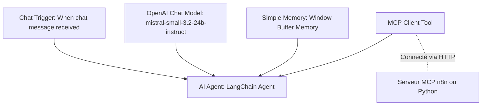
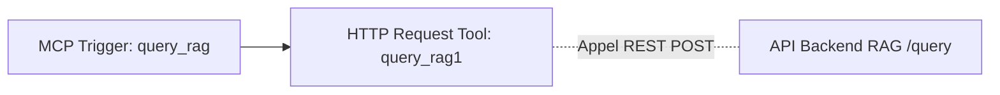

Cette partie de l'atelier se concentre sur l'intégration no-code/low-code des workflows agentiques à l'aide de **n8n** et du protocole **MCP (Model Context Protocol)**. Nous y découvrons comment exploiter un système de RAG (Retrieval-Augmented Generation), l'exposer via un serveur MCP, puis orchestrer le tout de manière visuelle et modulaire.

---

### 1. 🧠 Le Système RAG et son API (Dossier [backend](./iana-n8n/backend))

Le système RAG permet à l'agent d'accéder à des connaissances spécifiques (ici, des documents PDF) de façon dynamique.

* **Stack Technique** :

  * **[FastAPI](https://fastapi.tiangolo.com/)** : Un framework web Python asynchrone à haute performance pour exposer les points d'entrée de l'API.
  * **[Kreuzberg](https://github.com/Goldziher/kreuzberg)** : Une bibliothèque moderne d'intelligence documentaire assurant l'extraction de texte, le chunking intelligent (découpage) et la génération d'embeddings vectoriels multilingues via ONNX.
  * **[ChromaDB](https://www.trychroma.com/)** : Une base de données vectorielle légère et performante pour indexer et persister les segments de documents.
* **Endpoints exposés** :

  * `POST /ingest` : Reçoit un fichier PDF, extrait son contenu textuel, le découpe en segments optimisés, génère les embeddings et les stocke dans la collection vectorielle.
  * `POST /query` : Reçoit une question utilisateur en langage naturel, calcule son embedding via Kreuzberg, recherche les segments les plus pertinents dans ChromaDB et renvoie les résultats triés avec un score de similarité.
  * `POST /clear` : Purge l'ensemble de la base de données vectorielle et supprime les fichiers PDF indexés pour réinitialiser le système.
* **Fichiers clés** :

  * [backend/main.py](./iana-n8n/backend/main.py) : Point d'entrée de l'API FastAPI et définition des routes.
  * [backend/rag_service.py](./iana-n8n/backend/rag_service.py) : Logique métier du RAG encapsulant l'utilisation de Kreuzberg et l'intégration de ChromaDB.
  * [backend/schemas.py](./iana-n8n/backend/schemas.py) : Modèles de données Pydantic pour valider les requêtes et les réponses.

---

### 2. 🔌 L'Exposition via le Serveur MCP (Dossier [mcp](./iana-n8n/mcp))

Pour que des agents IA puissent consommer l'API RAG de manière standardisée, nous mettons en place un serveur **Model Context Protocol (MCP)**.

* **Fonctionnement** :

  * Développé avec le SDK **[FastMCP](https://github.com/jestlas/fastmcp)** en Python.
  * Il expose un outil universel appelé `query_rag` que tout client compatible MCP (comme Claude Desktop ou Cursor) peut invoquer à la volée.
  * Le serveur MCP joue le rôle d'adaptateur : lorsqu'il reçoit un appel de l'agent IA, il effectue une requête HTTP POST `/query` vers l'API FastAPI du backend, formate les résultats récupérés (contenus textuels, métadonnées comme la source PDF, numéros de pages, score de pertinence) en une réponse textuelle claire, et la retourne à l'agent.
* **Fichiers clés** :

  * [mcp/mcp_server.py](./iana-n8n/mcp/mcp_server.py) : Script principal initialisant le serveur FastMCP et implémentant l'outil `query_rag`.
  * [mcp/USER_GUIDE.md](./iana-n8n/mcp/USER_GUIDE.md) : Guide pas à pas détaillant le lancement du serveur et sa configuration dans Claude Desktop et Cursor.

---

### 3. 🤖 Construction de Workflows Agents sous n8n ([Atelier.json](./iana-n8n/scripts_n8n/Atelier.json))

Le fichier [Atelier.json](./iana-n8n/scripts_n8n/Atelier.json) contient la configuration d'un agent conversationnel avancé sous n8n intégrant directement des outils MCP externes.

* **Composants du workflow** :
  * **When chat message received** : Déclencheur initiant une session de chat interactive dans n8n.
  * **AI Agent** : Le nœud décisionnel principal configuré avec l'architecture LangChain (version 3.1).
  * **OpenAI Chat Model** : Le moteur d'intelligence (ici configuré pour interroger `mistral-small-3.2-24b-instruct`).
  * **Simple Memory** : Assure la persistance du contexte de discussion au fil des échanges.
  * **MCP Client** : Permet à l'agent de se connecter dynamiquement à un point d'accès MCP externe.
    * Dans le fichier [Atelier.json](./iana-n8n/scripts_n8n/Atelier.json), le client se connecte à un serveur MCP exposé directement par n8n sur `http://127.0.0.1:5678/mcp/46bb489d-ce0c-46d5-a854-6cd2c0dcdd81`.
    * Dans le fichier [Atelier avec MCP python.json](./iana-n8n/scripts_n8n/Atelier%20avec%20MCP%20python.json), il se connecte à notre serveur FastMCP Python autonome sur `http://127.0.0.1:10000/mcp`.

---

### 4. 📦 Wrapper une API et l'exposer en MCP dans n8n ([Serveur MCP.json](./iana-n8n/scripts_n8n/Serveur%20MCP.json))

Le fichier [Serveur MCP.json](./iana-n8n/scripts_n8n/Serveur%20MCP.json) démontre la flexibilité bidirectionnelle de n8n : non seulement il peut consommer des outils MCP, mais il peut également **exposer ses propres scénarios sous forme d'outils MCP** pour d'autres agents.

* **Composants du workflow** :
  * **MCP Trigger** (`query_rag`) : Ce nœud expose un point d'accès webhook MCP. Il définit un outil MCP nommé `query_rag` avec les métadonnées de paramètres attendues par le LLM appelant (la question en entrée).
  * **HTTP Request Tool** (`query_rag1`) : Lorsque le déclencheur MCP est sollicité, ce nœud est exécuté. Il effectue un appel HTTP POST vers l'API locale du RAG (`http://127.0.0.1:8000/query`).
  * **Mapping Dynamique** : Il injecte la question envoyée par l'agent appelant à l'aide de la formule dynamique de n8n : `{{ $fromAI('parameters0_Value', '', 'string') }}`.
  * Le résultat retourné par le backend FastAPI est automatiquement renvoyé en réponse à l'agent à l'origine de l'appel.

Grâce à cette approche, vous pouvez transformer n'importe quel flux n8n complexe (connectant potentiellement des dizaines d'APIs tierces comme Slack, Jira, Salesforce) en un simple outil MCP actionnable par n'importe quel LLM ou agent autonome !
