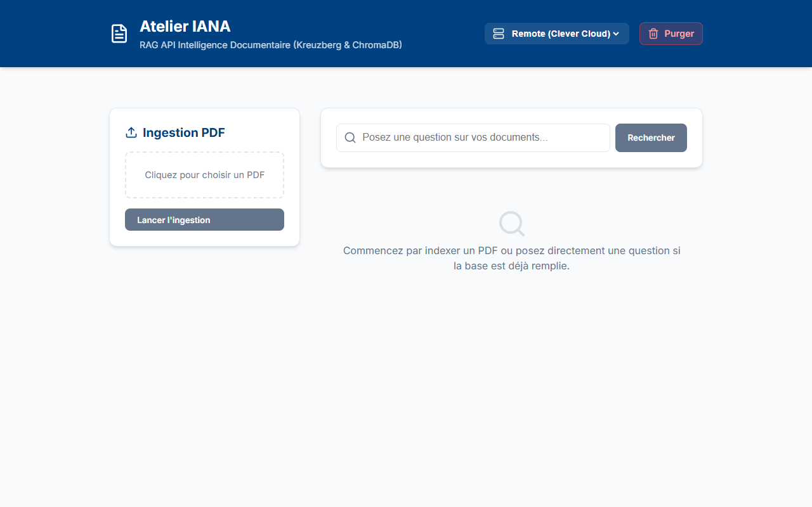

# 💻 Guide Utilisateur - Interface Frontend Atelier IANA

Bienvenue dans le guide de l'interface utilisateur d'**Atelier IANA**. Cette interface moderne et réactive, développée avec **React**, **Vite** et **TypeScript**, vous permet d'interagir graphiquement avec votre base de connaissances documentaire sans écrire une seule ligne de code.

---

## 📋 Table des Matières

1. [Aperçu de l'Interface](#-aperçu-de-linterface)
2. [Fonctionnalités Clés](#-fonctionnalités-clés)
3. [Démarrage Rapide (Développement Local)](#-démarrage-rapide-développement-local)
4. [Guide d'Utilisation pas-à-pas](#-guide-dutilisation-pas-à-pas)
5. [Dépannage (Troubleshooting)](#-dépannage-troubleshooting)

---

## 🎨 Aperçu de l'Interface

Voici une vue d'ensemble de l'interface d'**Atelier IANA**, présentant la disposition en deux colonnes (Ingestion à gauche, Recherche à droite) :



---

## 🌟 Fonctionnalités Clés

*   **Sélecteur d'Environnement** : Un menu déroulant dans l'en-tête permet de basculer instantanément entre votre serveur local (`http://localhost:8000`) et le serveur distant déployé sur **Clever Cloud**.
*   **Ingestion de Documents** : Une zone interactive de glisser-déposer (drag & drop) pour sélectionner et indexer vos fichiers PDF.
*   **Recherche Sémantique RAG** : Un champ de saisie intelligent qui interroge la base vectorielle et affiche les résultats ordonnés par score de pertinence, avec les sources et pages d'origine.
*   **Purge de Base de Données** : Un bouton de réinitialisation complète sécurisé par une double confirmation modale pour nettoyer la base ChromaDB et les fichiers stockés.

---

## 🚀 Démarrage Rapide (Développement Local)

### Prérequis
*   **Node.js** : Version `>= 18` installée.
*   Le **Backend RAG** lancé à l'adresse `http://localhost:8000`.

### 1. Installation des dépendances
Déplacez-vous dans le dossier `frontend/` et installez les paquets requis :

```bash
cd frontend
npm install
```

### 2. Lancement du serveur de développement
Démarrez l'application localement :

```bash
npm run dev
```

L'application sera accessible dans votre navigateur à l'adresse **`http://localhost:5173`**.

---

## 📖 Guide d'Utilisation pas-à-pas

### Étape 1 : Choix du Backend
Avant toute opération, sélectionnez le serveur cible dans le coin supérieur droit de l'en-tête :
*   **Local** (si vous exécutez le backend sur votre machine).
*   **Remote (Clever Cloud)** (pour utiliser l'infrastructure partagée).

---

### Étape 2 : Ingestion d'un Document PDF
1.  Dans la colonne de gauche (**Ingestion PDF**), cliquez sur la zone pointillée.
2.  Sélectionnez un fichier PDF valide sur votre ordinateur. Son nom s'affiche alors dans la zone.
3.  Cliquez sur le bouton bleu **"Lancer l'ingestion"**.
4.  L'application affiche un indicateur de chargement pendant que Kreuzberg découpe et vectorise le document.
5.  Une fois l'ingestion terminée, un message vert confirme le succès en indiquant le nombre de segments (chunks) indexés.

---

### Étape 3 : Recherche de Connaissances
1.  Saisissez une question ou des mots-clés dans la barre de recherche à droite (ex: *"Qu'est-ce que l'IANA ?"*).
2.  Cliquez sur **"Rechercher"** ou appuyez sur `Entrée`.
3.  Les résultats s'affichent sous forme de cartes élégantes contenant :
    *   Le numéro du résultat (par ordre décroissant de pertinence).
    *   Le **Score de similarité** (ex: `0.9450`). Plus le score est proche de `1.0`, plus le segment répond précisément à la question.
    *   L'extrait de texte brut contenant l'information.
    *   La source du document et les pages de provenance (ex: *Source: doc.pdf, Page: 4*).

---

### Étape 4 : Nettoyer la Base
Si vous souhaitez vider complètement votre base documentaire :
1.  Cliquez sur le bouton rouge **"Purger"** dans l'en-tête.
2.  Une fenêtre modale de confirmation s'affiche pour éviter les erreurs.
3.  Cliquez sur **"Confirmer"** pour valider la suppression définitive de tous les vecteurs et fichiers associés.

---

## ❓ Dépannage (Troubleshooting)

### 🔴 L'ingestion ou la recherche affiche "Erreur lors de la recherche"
*   **Cause** : Le frontend ne parvient pas à joindre l'API backend sélectionnée.
*   **Solution** :
    1.  Vérifiez que le serveur backend tourne (sur le port `8000` si vous êtes en local).
    2.  Assurez-vous que vous n'avez pas de bloqueur de requêtes (ex: extensions de navigateur type AdBlockers) bloquant les requêtes vers `localhost`.

### 🔴 L'ingestion d'un fichier prend beaucoup de temps
*   **Cause** : Le document PDF est volumineux et l'extraction de texte/génération d'embeddings prend plus de temps.
*   **Solution** : Patientez sans fermer la page. Pour les documents de plus de 100 pages, il est recommandé de les découper en plusieurs fichiers plus petits pour un traitement plus rapide.
