# Workshop IA-NA 2026 — Agents IA & MCP avec Otoroshi

Ce guide pas-à-pas accompagne les participants du workshop **IA-NA 2026** dans la mise en place d'agents IA s'appuyant sur le protocole **[MCP](https://modelcontextprotocol.io/)** (Model Context Protocol), exposés et sécurisés via **[Otoroshi](https://www.otoroshi.io/)** (et sa [LLM extension](https://cloud-apim.github.io/otoroshi-llm-extension/)).

À l'issue du workshop, vous aurez construit **trois agents de complexité croissante** :

1. **Niveau 1** — Un agent simple connecté à un MCP métier (RAG sur des contrats d'assurance).
2. **Niveau 2** — Le même agent enrichi : exposition API/MCP, sécurité (API key, OAuth), budget, observabilité et guardrails.
3. **Niveau 3** — Un agent multi-MCP combinant le RAG, un MCP « Risques majeurs » et le MCP « DevQuest » pour produire un rapport contextualisé.

---

## Sommaire

- [Infrastructure & prérequis](#infrastructure--prérequis)
- [Endpoint Clever AI & clé d'API](#endpoint-clever-ai--clé-dapi)
- [URLs et personnalisation par participant](#urls-et-personnalisation-par-participant)
- [Niveau 1 — Agent RAG simple](#niveau-1--agent-rag-simple)
  - [Étape 1.1 — Créer le provider IA](#étape-11--créer-le-provider-ia-clever-ai)
  - [Étape 1.2 — Créer le connecteur MCP RAG](#étape-12--créer-le-connecteur-mcp-rag)
  - [Étape 1.3 — Créer le workflow agentique](#étape-13--créer-le-workflow-agentique)
- [Niveau 2 — Exposition, sécurité, budget, guardrails](#niveau-2--exposition-sécurité-budget-guardrails)
  - [Étape 2.1 — Exposer le workflow en API REST](#étape-21--exposer-le-workflow-en-api-rest)
  - [Étape 2.2 — Tester l'API](#étape-22--tester-lapi)
  - [Étape 2.3 — Exposer le workflow en MCP](#étape-23--exposer-le-workflow-en-mcp)
  - [Étape 2.4 — Protéger l'exposition MCP par OAuth](#étape-24--protéger-lexposition-mcp-par-oauth)
  - [Étape 2.5 — Mettre en place un budget IA](#étape-25--mettre-en-place-un-budget-ia)
  - [Étape 2.6 — Observabilité](#étape-26--observabilité)
  - [Étape 2.7 — Guardrails LLM](#étape-27--guardrails-llm)
- [Niveau 3 — Agent multi-MCP](#niveau-3--agent-multi-mcp)
  - [Étape 3.1 — Connecteur MCP Risques majeurs](#étape-31--connecteur-mcp-risques-majeurs)
  - [Étape 3.2 — Workflow Risques + RAG](#étape-32--workflow-risques--rag)
  - [Étape 3.3 — Connecteur MCP DevQuest](#étape-33--connecteur-mcp-devquest)
  - [Étape 3.4 — Workflow DevQuest + Risques + RAG](#étape-34--workflow-devquest--risques--rag)
- [Manifests fournis](#manifests-fournis)
- [URLs Otoroshi à valider](#urls-otoroshi-à-valider)

---

## Infrastructure & prérequis

Le workshop peut se dérouler sur deux types d'infrastructures :

### Option A — Hébergé sur Clever Cloud (recommandé)

Chaque participant dispose d'une **instance [n8n](https://n8n.io/)** et d'une **instance Otoroshi** provisionnées sur **[Clever Cloud](https://www.clever.cloud/)** :

| Service | URL |
| --- | --- |
| n8n | `https://n8n-workshop-iana-2026-${slug}.cleverapps.io/` |
| Backoffice Otoroshi | `https://${clever_random}-ui-otoroshi.services.clever-cloud.com` |
| Exposition des APIs / MCP via Otoroshi | `https://otoroshi-workshop-iana-2026-${slug}.cleverapps.io` |
| RAG API | `https://rag-api-workshop-iana-2026-${slug}.cleverapps.io` |
| RAG MCP | `https://rag-mcp-workshop-iana-2026-${slug}.cleverapps.io` |
| RAG Frontend | `https://rag-frontend-workshop-iana-2026-${slug}.cleverapps.io` |

- `${slug}` est unique par participant (par exemple `00`, `01`, etc.).
- `${clever_random}` est généré automatiquement par Clever Cloud lors du provisionnement de votre instance.

> 💡 **Besoin d'une instance n8n et/ou Otoroshi pour le workshop ?** L'infrastructure complète peut être provisionnée pour vous sur **Clever Cloud**. N'hésitez pas à le demander aux speakers en début de session, ils s'occuperont du provisionnement.

### Option B — Otoroshi en local

| Service | URL |
| --- | --- |
| Backoffice Otoroshi | `http://otoroshi.oto.tools:8080` |
| Exposition des APIs / MCP | `http://<n-importe-quoi>.oto.tools:8080` |

> ℹ️ Le domaine `*.oto.tools` est un wildcard DNS qui résout vers `127.0.0.1` : pratique pour exposer plusieurs routes Otoroshi en local sans toucher à votre fichier `/etc/hosts`.

#### B.1 — Lancer Otoroshi via Docker (le plus rapide)

L'image Docker [`maif/otoroshi`](https://hub.docker.com/r/maif/otoroshi) embarque déjà la **LLM extension**. Une seule commande suffit :

```bash
docker run -p "8080:8080" \
  -v "$(pwd)/filedb:/usr/app/otoroshi/filedb" \
  -e OTOROSHI_INITIAL_ADMIN_LOGIN=admin \
  -e OTOROSHI_INITIAL_ADMIN_PASSWORD=password \
  maif/otoroshi -Dotoroshi.storage=file
```

- `-Dotoroshi.storage=file` active le stockage fichier (persistance dans le volume `filedb`) — pas besoin de base externe.
- Le backoffice est ensuite accessible sur `http://otoroshi.oto.tools:8080` (login par défaut : `admin` / `password`).

#### B.2 — Lancer Otoroshi en Java pur

Si vous préférez exécuter Otoroshi directement sur votre JVM (JDK 17+ requis), suivez la procédure officielle de la [documentation de la LLM Extension](https://cloud-apim.github.io/otoroshi-llm-extension/docs/install).

**1. Récupérer les binaires** (jars Otoroshi + LLM extension) :

```bash
curl -L -o otoroshi.jar \
  'https://github.com/MAIF/otoroshi/releases/download/v17.16.0/otoroshi.jar'

curl -L -o otoroshi-llm-extension.jar \
  'https://github.com/cloud-apim/otoroshi-llm-extension/releases/download/0.0.76/otoroshi-llm-extension_2.12-0.0.76.jar'
```

> ℹ️ Pensez à vérifier sur la doc officielle si une version plus récente d'Otoroshi ou de l'extension est disponible.

**2. Démarrer Otoroshi** avec l'extension dans le classpath :

```bash
java -cp "./otoroshi-llm-extension.jar:./otoroshi.jar" \
  -Dotoroshi.adminLogin=admin \
  -Dotoroshi.adminPassword=password \
  -Dotoroshi.storage=file \
  play.core.server.ProdServerStart
```

Le backoffice est ensuite accessible sur `http://otoroshi.oto.tools:8080` (login `admin` / `password`).

### Notes générales

- Tous les screenshots de ce guide utilisent le slug `00` à titre d'exemple. **Adaptez les URLs à votre propre instance** (qu'elle soit Clever ou locale).
- Les identifiants de connexion au backoffice Otoroshi vous sont communiqués en début de workshop.

---

## Endpoint Clever AI & clé d'API

Le LLM utilisé pendant tout le workshop est **gracieusement fourni par [Clever Cloud](https://www.clever.cloud/)** via son service **[Clever AI](https://www.clever.cloud/clever-ai/)**. Vous n'avez donc pas besoin de fournir vos propres credentials OpenAI/Anthropic/etc.

- **Endpoint OpenAI-compatible** :
  ```
  https://endpoint-workshop-iana-2026.cc-ai-services.clever-cloud.com/v1/chat/completions
  ```
- **Modèle** : `gpt-5.5`
- **Clé d'API** (bearer token) : fournie en début de workshop, à stocker dans la variable d'environnement `IANA_OPENAI_TOKEN` de votre instance Otoroshi.

> 🔐 La clé d'API est référencée dans Otoroshi via la syntaxe vault : `${vault://env/IANA_OPENAI_TOKEN}`. Ne la mettez jamais en dur dans une configuration.

---

## URLs et personnalisation par participant

Toutes les URLs `otoroshi-workshop-iana-2026-${slug}.oto.tools` (ou `.cleverapps.io`) et tous les exemples de domaines (`.../api`, `.../mcp`) sont propres à votre instance. **Pensez à adapter** :

- le domaine de vos routes Otoroshi (frontend) ;
- les URLs d'appel depuis Postman/curl/MCP Inspector ;
- les domaines déclarés dans la configuration des routes.

---

# Niveau 1 — Agent RAG simple

**Objectif** : construire un agent qui répond à des questions sur des contrats d'assurance en allant interroger une base documentaire exposée en MCP.

Architecture cible :

```
Utilisateur ──► Workflow Otoroshi ──► AI Agent (Clever AI) ──► MCP RAG
```

## Étape 1.1 — Créer le provider IA Clever AI

Dans le backoffice Otoroshi :

> `Sidebar ▸ Categories ▸ AI - LLM ▸ LLM Providers ▸ Add item`
>
> URL : `<URL-backoffice-otoroshi>/bo/dashboard/extensions/cloud-apim/ai-gateway/providers`

Renseignez :

| Champ | Valeur |
| --- | --- |
| **Name** | `IANA Clever AI` |
| **Description** | `An OpenAI LLM api provider` |
| **Provider** | `OpenAI Compatible` |
| **Base URL** | `https://endpoint-workshop-iana-2026.cc-ai-services.clever-cloud.com/v1` |
| **API Token** | `${vault://env/IANA_OPENAI_TOKEN}` |
| **Timeout** | `180000` ms |
| **Models endpoint path** | `/models` |
| **Provider supports completion** | ✅ activé |
| **Provider tool calling** | ✅ activé |
| **Provider supports streaming** | ✅ activé |
| **Allow options override** | ✅ activé |
| **Model** | `gpt-5.5` |

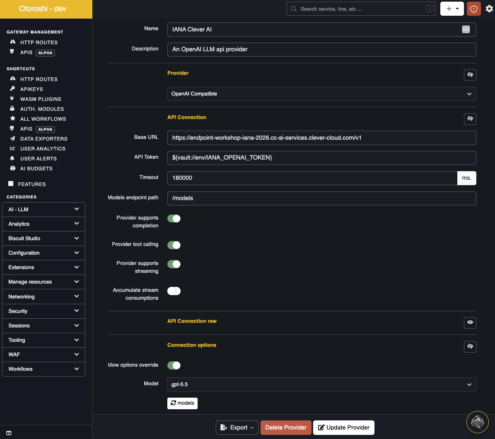

Sauvegardez. Vous pouvez vérifier que le bouton « models » liste bien les modèles disponibles côté Clever AI.

## Étape 1.2 — Créer le connecteur MCP RAG

> `Sidebar ▸ Categories ▸ AI - LLM ▸ MCP Connectors ▸ Add item`
>
> URL : `<URL-backoffice-otoroshi>/bo/dashboard/extensions/cloud-apim/ai-gateway/mcp-connectors`

Renseignez :

| Champ | Valeur |
| --- | --- |
| **Name** | `IANA RAG` |
| **Enabled** | ✅ |
| **Strict tool calls** | ❌ |
| **Pool size** | `1` |
| **Transport kind** | `HTTP` |
| **URL** | `https://rag-mcp-iana-agentic-workflows-workshop.cleverapps.io/mcp` ou `http://127.0.0.1:10000/mcp` |

> 💡 Si votre infrastructure RAG a été provisionnée sur **Clever Cloud** (RAG API / MCP / frontend dédiés), utilisez plutôt votre URL : `https://rag-mcp-workshop-iana-2026-${slug}.cleverapps.io/mcp`. Sinon, l'instance partagée ci-dessus reste utilisable.

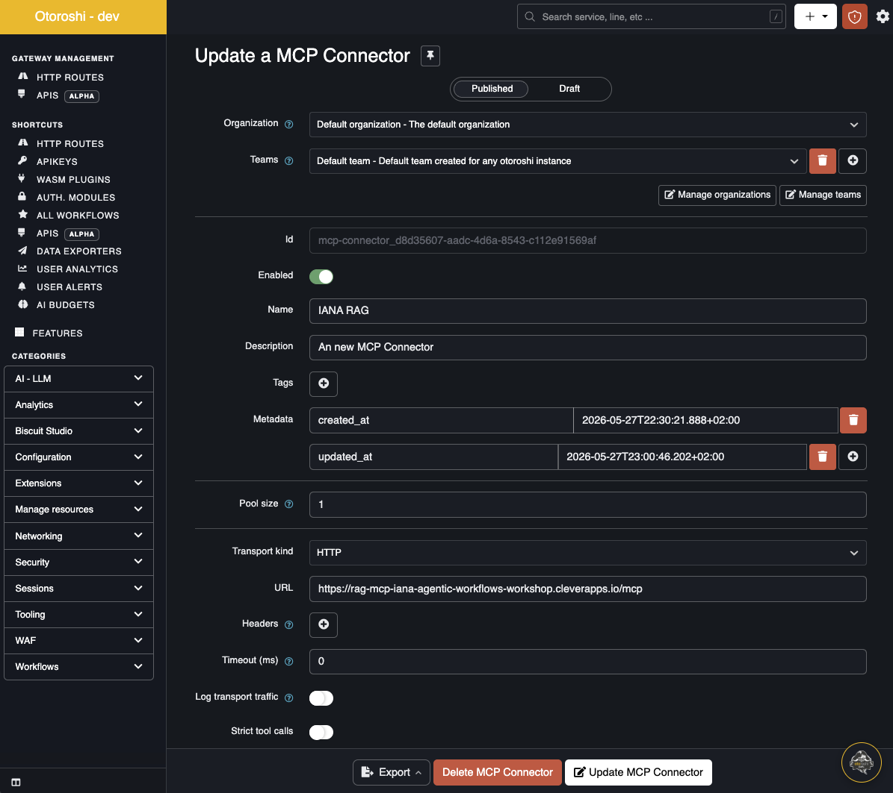

Sauvegardez.

## Étape 1.3 — Créer le workflow agentique

> `Sidebar ▸ Categories ▸ Workflows ▸ Workflows ▸ Add item`
>
> URL : `<URL-backoffice-otoroshi>/bo/dashboard/extensions/workflows/workflows`

Nommez le workflow **`IANA RAG simple`**. Vous arrivez sur l'éditeur visuel de workflow.

L'objectif est de construire le pipeline suivant :

```
[Start] ─► [AI Agent] ─► [Returned]
                │
                └─► [MCP Tools : IANA RAG]
```

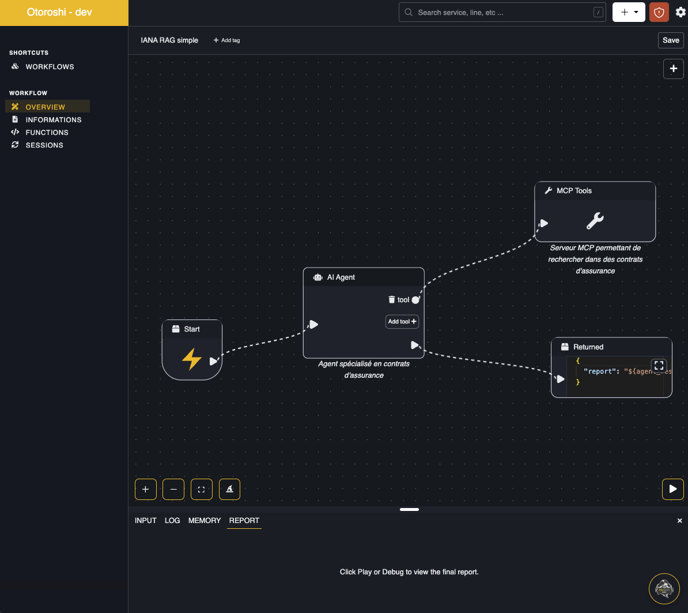

### Nœud `AI Agent`

Ajoutez un nœud `AI Agent` (ne **surtout** pas prendre `AI Agent (function)`) et configurez-le :

- **LLM provider** : `IANA Clever AI`
- **Instructions** :
  ```
  Tu es un agent spécialisé dans l'analyse de contrats d'assurance.
  Tu as a ta disposition un connecteur MCP pour chercher dans des contrats d'assurance.
  Tu vas répondre aux questions de l'utilisateurs sur ses contrats
  ```
- **Agent input** :
  ```
  ${workflow_input.query || workflow_input.request.body_json.query}
  ```
  (permet de fonctionner aussi bien en test direct que via exposition HTTP).
- **Result** : `agent_result`

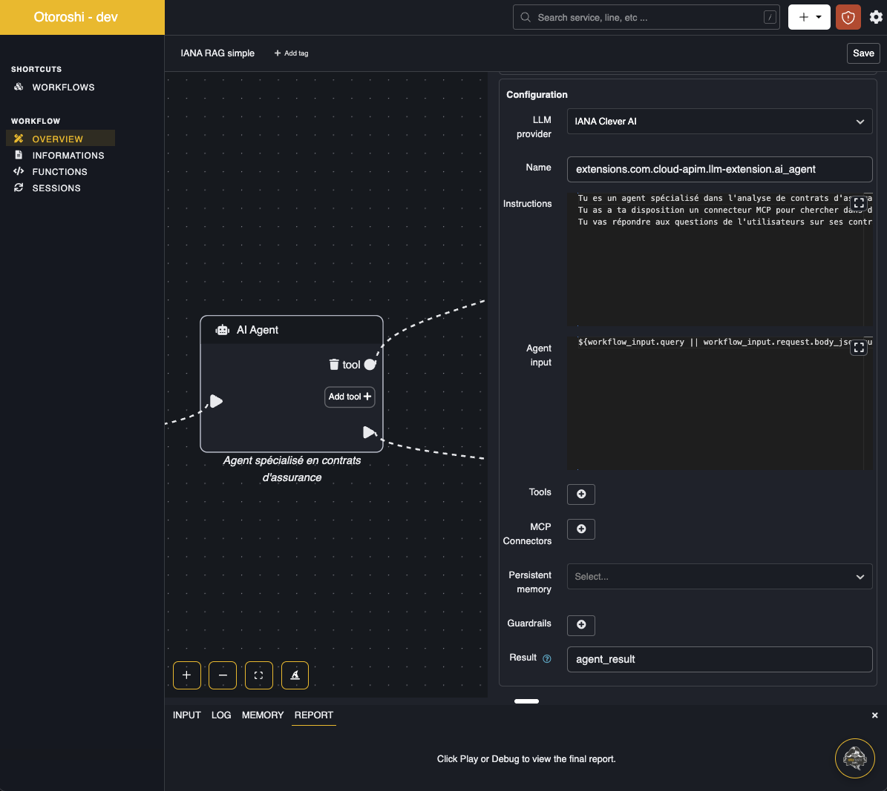

### Nœud `MCP Tools`

Ajoutez un noeud **`MCP Tools`** dans le workflow. Configurez :

- **Description** : `Serveur MCP permettant de rechercher dans des contrats d'assurance`
- **MCP Connectors** : `IANA RAG`

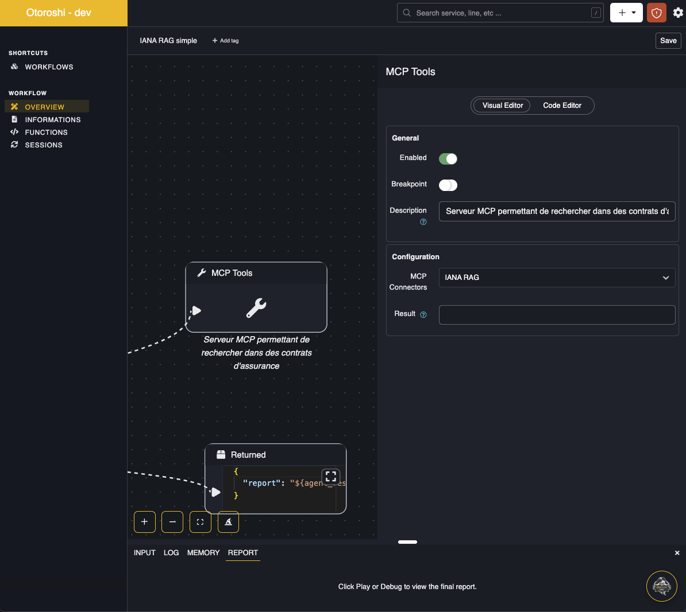

Connectez le noeud `Start` au noeud `AI Agent`.

Sur le nœud `AI Agent`, cliquez sur **`Add tool +`** et linkez le noeud **`MCP Tools`**. 

### Nœud `Returned`

Configurez la sortie du workflow :

```json
{
  "report": "${agent_result}"
}
```

puis connectez la sortie du noeud `AI Agent` au noeud `Returned`;

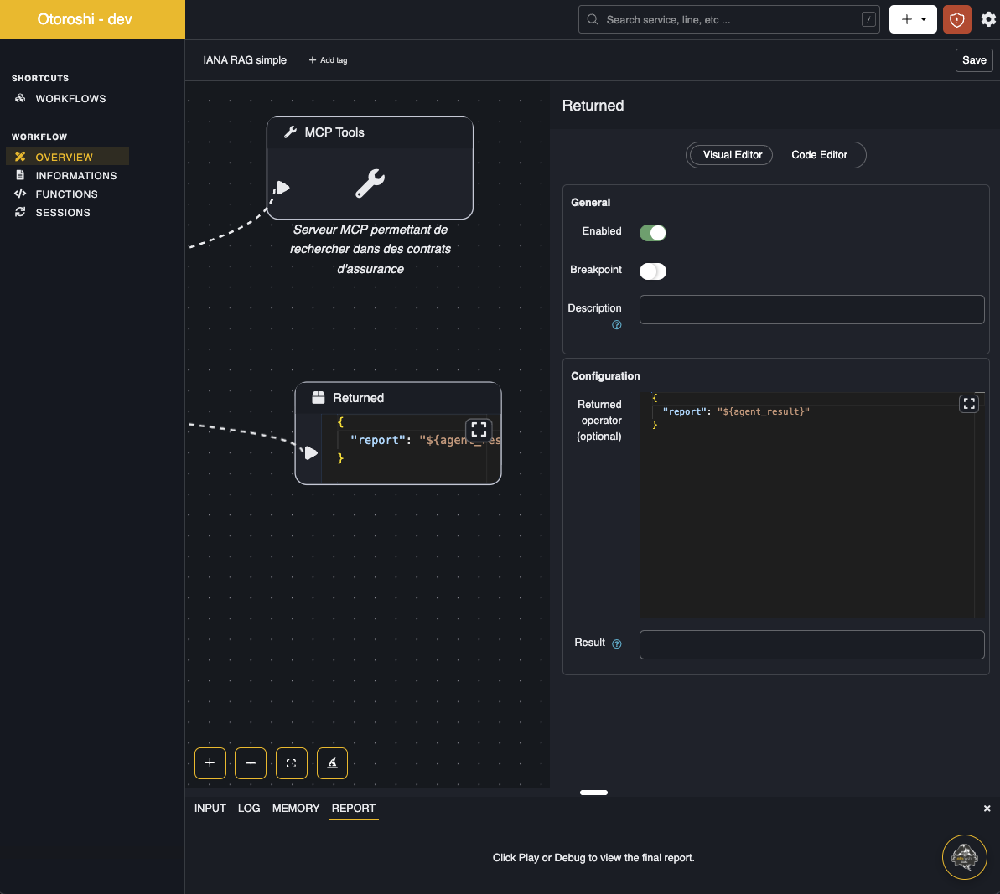

### Tester le workflow

Dans le panneau **INPUT** en bas, saisissez :

```json
{
  "query": "assurance habitation"
}
```

Cliquez ensuite sur le bouton **▶ Play** en bas à droite. Vous devriez obtenir un rapport généré à partir des contrats d'assurance.

---

# Niveau 2 — Exposition, sécurité, budget, guardrails

**Objectif** : passer du workflow « jouable depuis l'éditeur » à un **agent exposé en production** via Otoroshi, avec API management, sécurité, budgets, observabilité et guardrails.

## Étape 2.1 — Exposer le workflow en API REST

> `Sidebar ▸ Categories ▸ Manage resources ▸ HTTP Routes ▸ + Create new route`
>
> URL : `<URL-backoffice-otoroshi>/bo/dashboard/routes`

Créez une route nommée **`IANA RAG Simple API`** :

- **Frontend domains** : `otoroshi-workshop-iana-2026-${slug}.cleverapps.io/api` (Clever) ou `<n-importe-quoi>.oto.tools/api` (local)
- **Backend** : laissez la cible par défaut (elle sera court-circuitée par le plugin Workflow Backend).

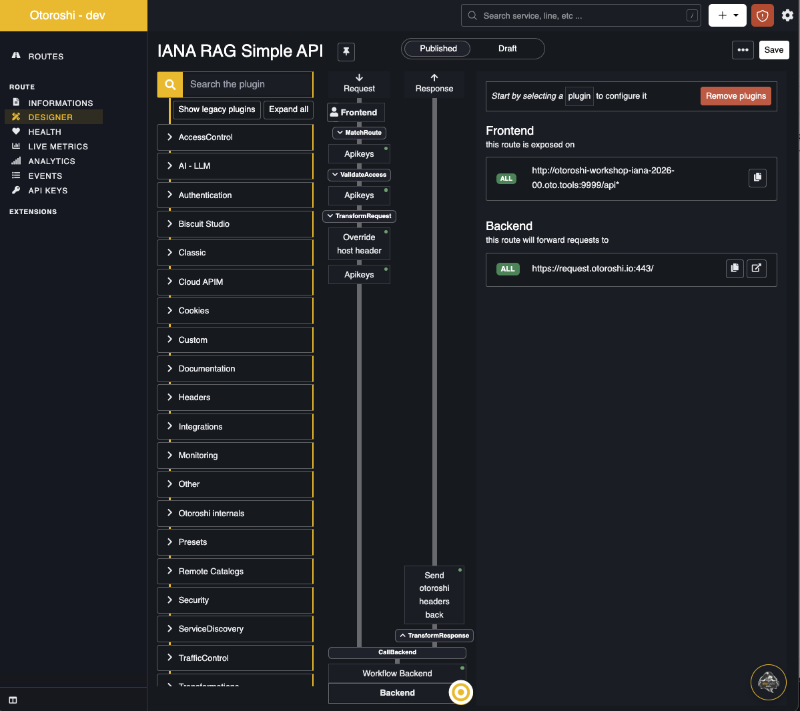

### Plugins de la route

Dans le designer de la route, configurez ces plugins :

| Plugin | Rôle |
| --- | --- |
| **Override host header** | force le `Host` côté backend, déjà ajouté par défaut |
| **Workflow Backend** | court-circuite le backend HTTP et exécute le workflow `IANA RAG simple` |
| **Apikeys** | rend la route accessible uniquement via clé d'API |
| **Send otoroshi headers back** | ajoute les en-têtes `otoroshi-*` à la réponse |

Pour le plugin **Workflow Backend**, sélectionnez `IANA RAG simple` comme workflow :

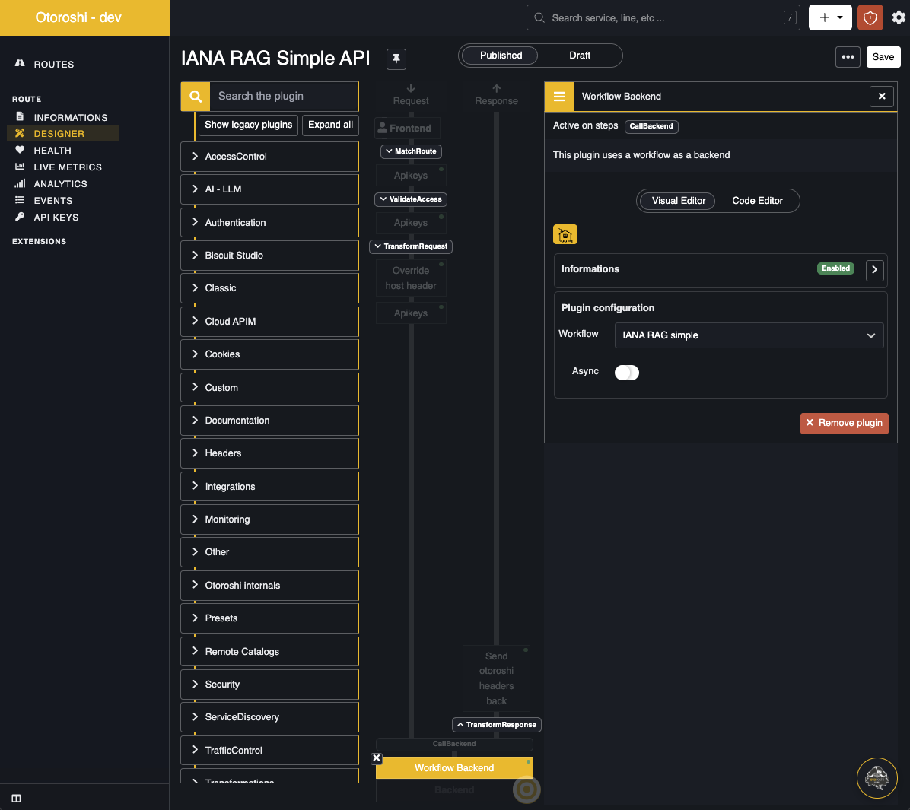

### Créer une clé d'API

> `Page de la route ▸ Sidebar ▸ Apikeys ▸ Add item`
>
> ou 
>
> `Sidebar ▸ Categories ▸ Manage resources ▸ Apikeys ▸ Add item`
>
> URL : `<URL-backoffice-otoroshi>/bo/dashboard/apikeys`

Créez une clé d'API rattachée au groupe `default` (ou à un groupe dédié au workshop). Notez le `client_id` / `client_secret` générés.

C'est ici que vous pouvez configurer :

- **Quotas** (appels/jour, appels/mois) ;
- **Throttling** (rate limiting) ;
- **Read-only / accès restreint** ;
- **Métadonnées** (utiles plus tard pour les budgets).

vérifiez bien que le nom de la route `IANA RAG Simple API` apparait bien dans la section `Authorized on`

## Étape 2.2 — Tester l'API

Avec Postman (ou curl), sur l'URL d'exposition d'Otoroshi :

- Sur Clever : `https://otoroshi-workshop-iana-2026-${slug}.cleverapps.io/api`
- En local : `http://<n-importe-quoi>.oto.tools:8080/api`

```http
GET <URL-exposition-otoroshi>/api
Authorization: Basic <base64(client_id:client_secret)>
Content-Type: application/json

{
  "query": "quelles sont mes garanties d'assurance ?"
}
```

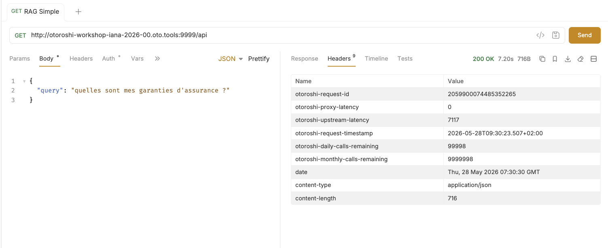
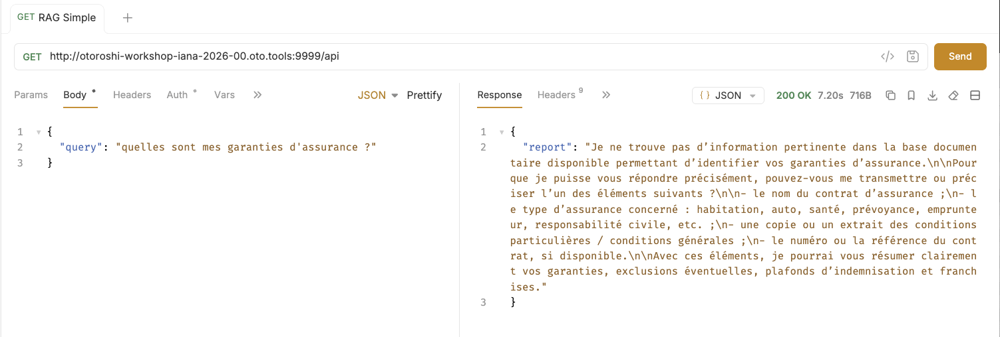

Vous obtenez en retour un objet `{ "report": "..." }`. Les en-têtes `otoroshi-daily-calls-remaining` et `otoroshi-monthly-calls-remaining` confirment que la clé d'API et les quotas fonctionnent.

## Étape 2.3 — Exposer le workflow en MCP

Pour pouvoir « brancher » d'autres agents ou IDE (Claude Desktop, Cursor, MCP Inspector, etc.) sur ce workflow, on l'expose **comme un outil MCP**.

### Créer une « Tool Function »

> `Sidebar ▸ Categories ▸ AI - LLM ▸ LLM Tool Functions ▸ Add item`
>
> URL : `<URL-backoffice-otoroshi>/bo/dashboard/extensions/cloud-apim/ai-gateway/tool-functions`

| Champ | Valeur |
| --- | --- |
| **Name** | `get_insurance_report` |
| **Description** | `Return insurance_report based on legal insurance documents. Needs a 'query' parameter and returns a 'report' about it` |
| **Strict** | ✅ |
| **Backend Kind** | `Workflow` |
| **Workflow** | `IANA RAG simple` |
| **Parameters spec** | `{ "query": { "type": "string", "description": "User query about insurance legal docs content" } }` |
| **Required params** | `query` |

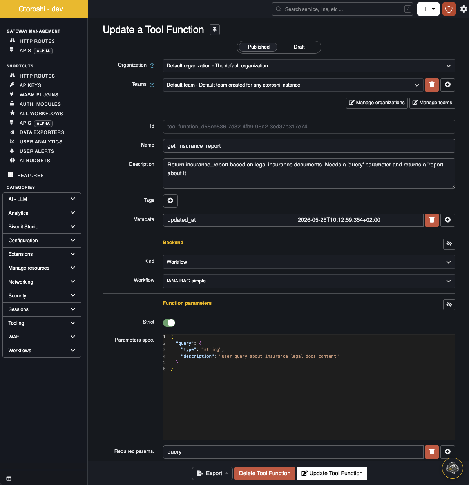

### Créer la route d'exposition MCP

> `Sidebar ▸ Categories ▸ Manage resources ▸ HTTP Routes ▸ Add item`

Créez une route nommée **`IANA RAG Simple MCP`** :

- **Frontend domains** : `otoroshi-workshop-iana-2026-${slug}.cleverapps.io/mcp` (Clever) ou `<n-importe-quoi>.oto.tools/mcp` (local)
- Plugin principal : **`Cloud APIM - MCP HTTP Endpoint`** (catégorie `AI - LLM`).

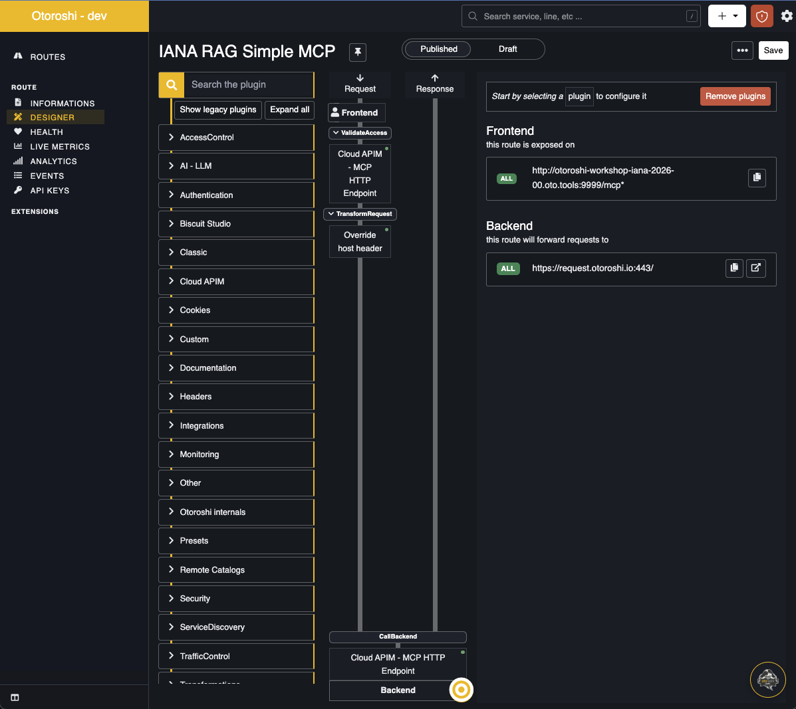

Configurez le plugin `Cloud APIM - MCP HTTP Endpoint` :

- **MCP server name** : `IANA-RAG`
- **MCP server version** : `1.0.0`
- **LLM Tool Functions** : `get_insurance_report`
- **Emit audit events** : ✅

> 💡 Vous pouvez wrapper plusieurs `Tool Functions` et/ou des `MCP Connectors` complets derrière une seule route MCP : c'est ce qui vous permet d'agréger plusieurs sources métier en un MCP unique.

### Protection par clé d'API

Pour la première exposition MCP, on protège la route via une simple clé d'API : ajoutez le plugin **`Apikeys`** comme pour la route REST.

### Tester avec MCP Inspector

Lancez [MCP Inspector](https://github.com/modelcontextprotocol/inspector) depuis un terminal (aucune installation préalable nécessaire, `npx` télécharge et exécute la dernière version) :

```bash
npx @modelcontextprotocol/inspector
```

Puis connectez-vous :

- **Transport Type** : `Streamable HTTP`
- **URL** : `https://otoroshi-workshop-iana-2026-${slug}.cleverapps.io/mcp` (Clever) ou `http://<n-importe-quoi>.oto.tools:8080/mcp` (local)
- **Authentication** : Basic (client_id/client_secret de la clé d'API)

Listez les outils — vous devez voir `get_insurance_report` :

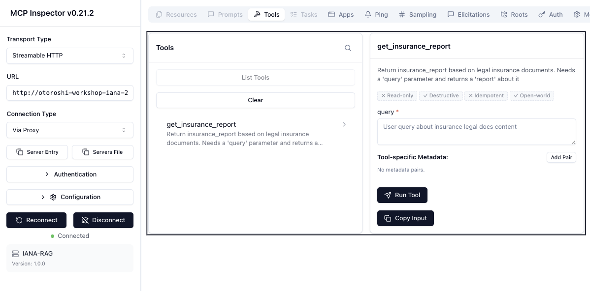

Appelez l'outil avec une requête :

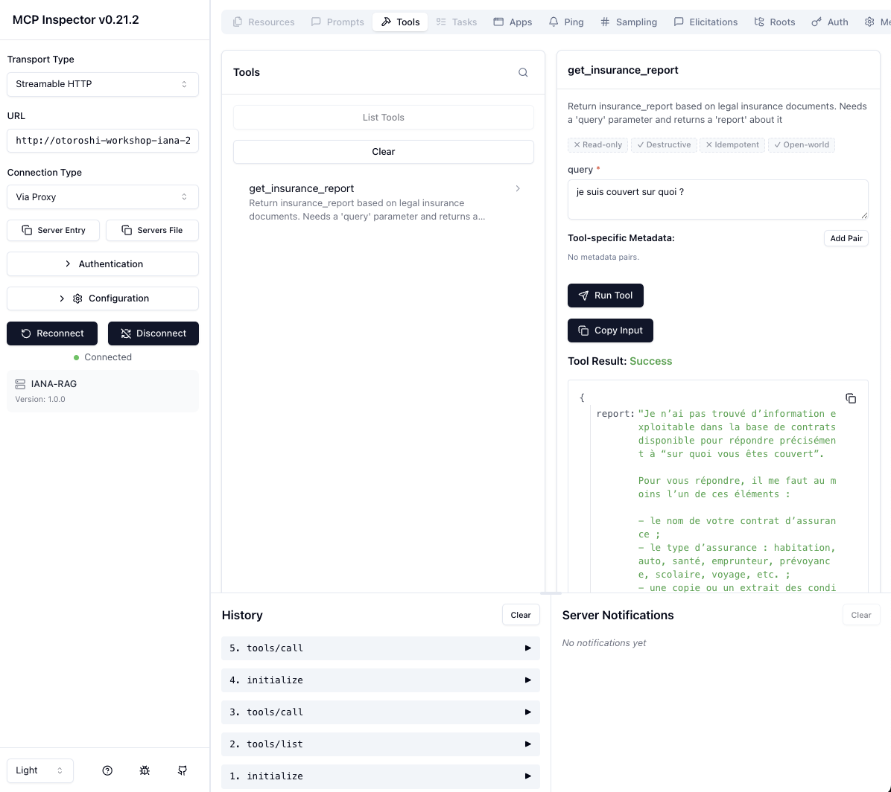

## Étape 2.4 — Protéger l'exposition MCP par OAuth (démonstration)

Le plugin MCP HTTP Endpoint sait nativement aussi gérer l'authentification **OAuth 2.x** (auth flow standard MCP). Cette étape est présentée **à titre informatif** : pas besoin de la réaliser vous-même pendant le workshop.

Sur la route `IANA RAG Simple MCP`, il suffit d'activer :

- **Enforce OAuth** : ✅
- **Auth module** : un module d'auth OAuth déjà configuré dans Otoroshi (ex. `Keycloak`)
- **OAuth PRM URL** : `<URL-exposition-otoroshi>/.well-known/oauth-protected-resource`

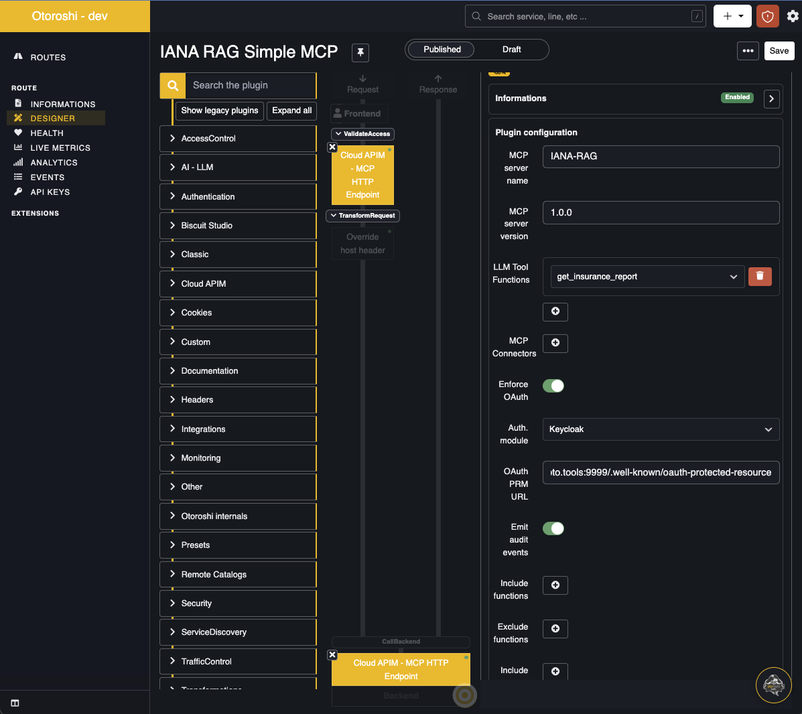

> 💡 En production, vous pouvez maintenir deux routes en parallèle (par exemple `/mcp-apikey` et `/mcp-oauth`) pour offrir les deux modes d'authentification. Si vous voulez creuser le sujet ou voir une démo live de la mise en place complète (création du module d'auth, intégration Keycloak, etc.), **n'hésitez pas à en discuter avec les speakers** pendant ou après le workshop.

## Étape 2.5 — Mettre en place un budget IA

Otoroshi permet de plafonner la consommation IA (tokens et/ou USD) par **provider**, par **API key**, par **utilisateur**, par **groupe**, etc.

> `Sidebar ▸ Categories ▸ AI - LLM ▸ AI Budgets ▸ Add item`
>
> URL : `<URL-backoffice-otoroshi>/bo/dashboard/extensions/cloud-apim/ai-gateway/ai-budgets`

### Budget rattaché au provider

Créez un budget nommé **`IANA Budget Provider`** :

- **Enabled** : ✅
- **Start at / End at** : la période d'application
- **Duration** : `30 days` (renouvellement)
- **Limits** :
  - Total Tokens : `10 000 000`
  - Total USD : `10`
- **Scope** :
  - **Providers** : `IANA Clever AI`
- **Action on exceed** : `block`, alertes activées à 80 %

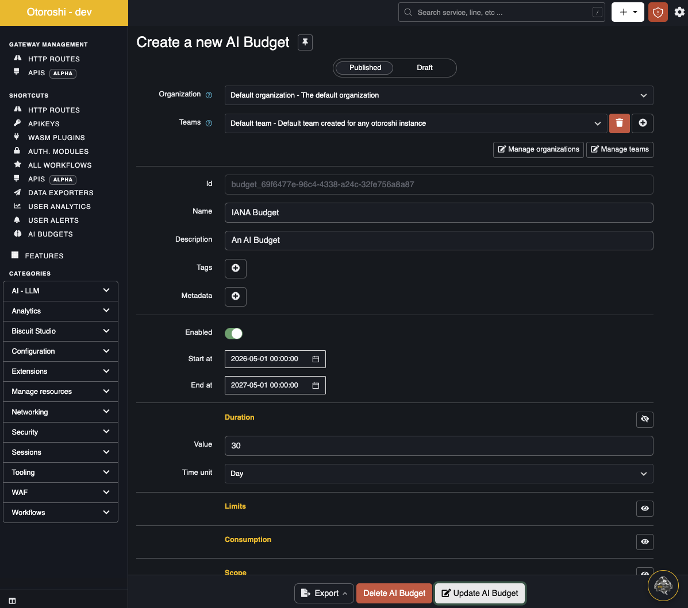
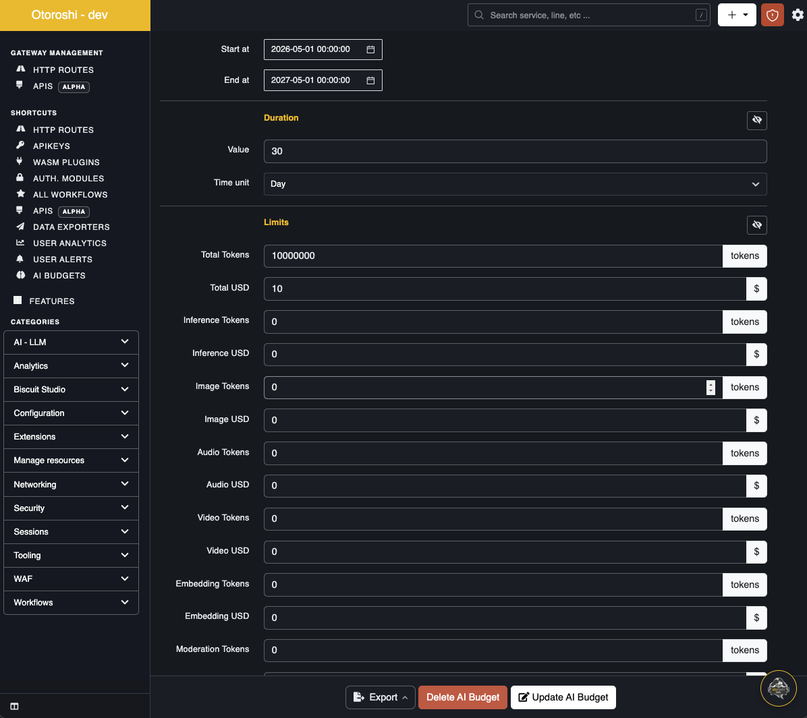
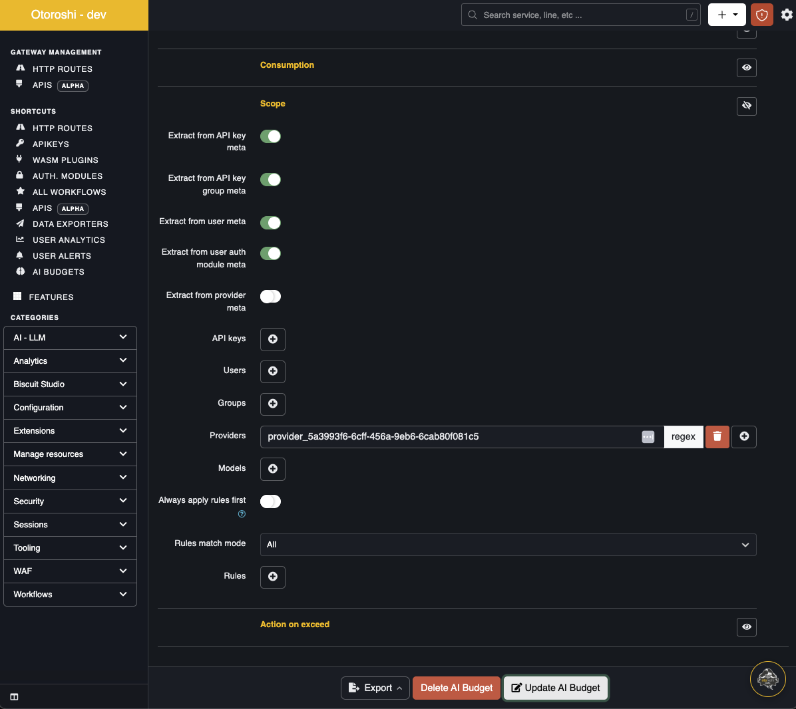

### Visualisation de la consommation

Une fois quelques appels effectués, la section **Consumption** du budget affiche la consommation en temps réel :

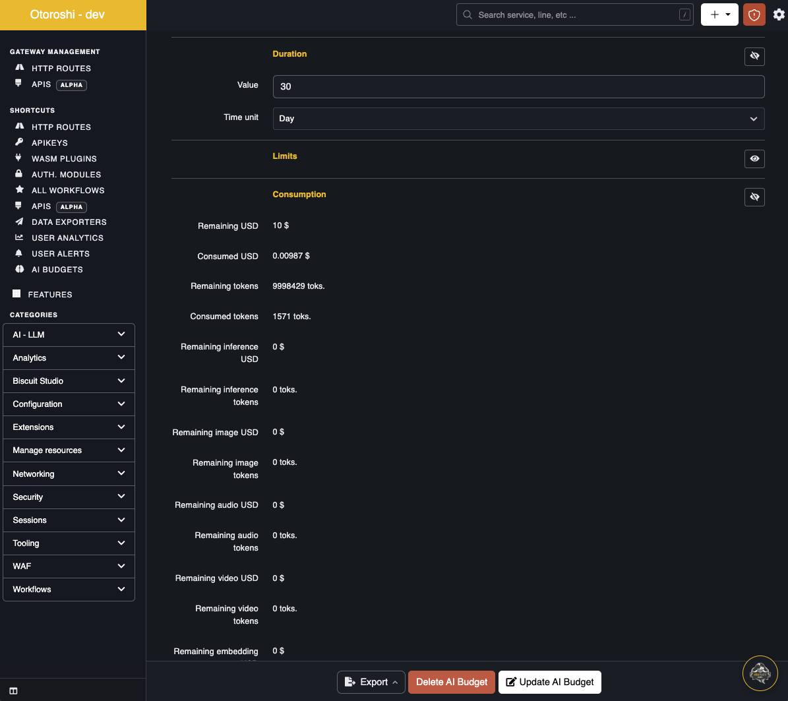

### Variante : budget par clé d'API

Pour démontrer la granularité par client, créez un second budget **`IANA Budget APIKEY`** dont le scope est restreint à une `API Key` particulière :

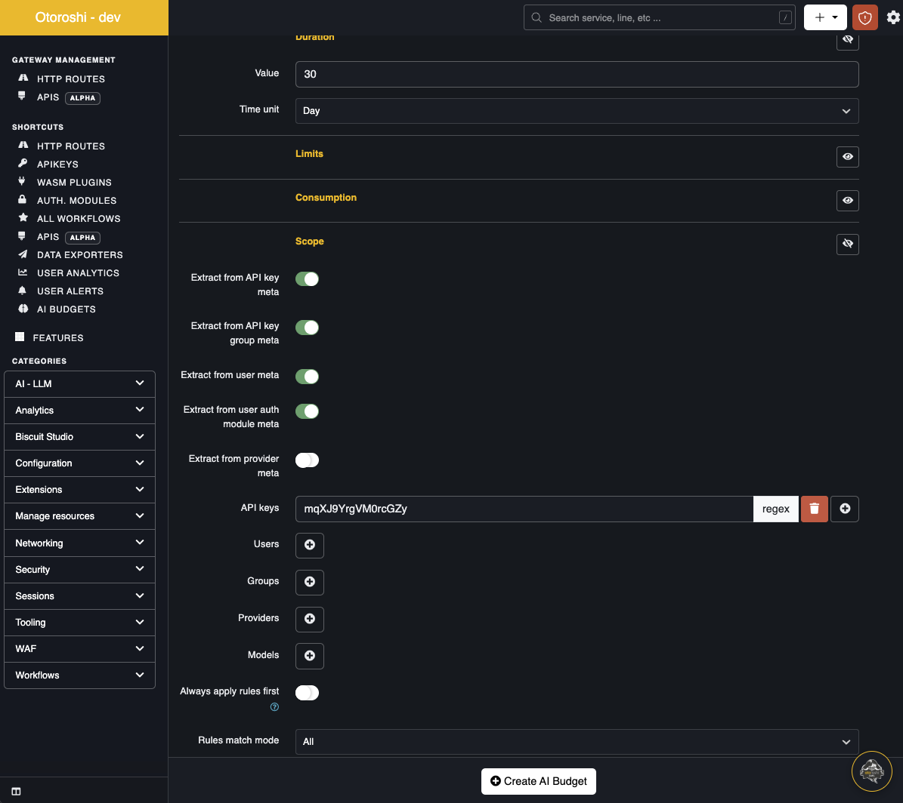

> 💡 Pour le workshop, le rattachement **par provider** est le plus parlant : il montre une limite globale du budget IA quel que soit l'appelant. Le rattachement **par API key** est utile dès qu'on commercialise l'agent à plusieurs clients.

## Étape 2.6 — Observabilité

Otoroshi capture nativement :

- les **logs** d'appel (request / response / latence) ;
- les **audit events** (création/modification d'entités) ;
- les **events de workflow** (`WorkflowRunEvent`) avec input / output / steps ;
- les **health checks** des backends ;
- les **métriques** (Prometheus / OpenTelemetry).

> `Sidebar ▸ Categories ▸ Tooling ▸ Node Events Stream`
>
> URL : `<URL-backoffice-otoroshi>/bo/dashboard/node/eventstream`

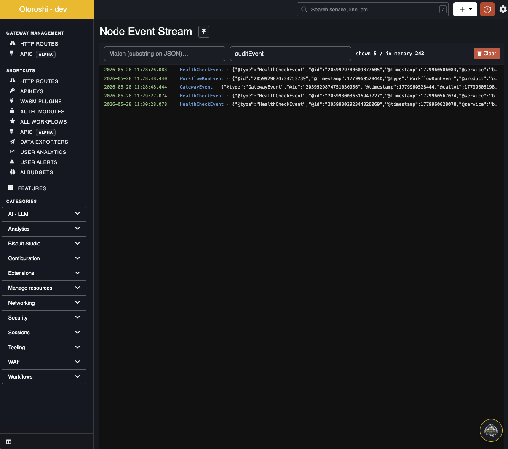
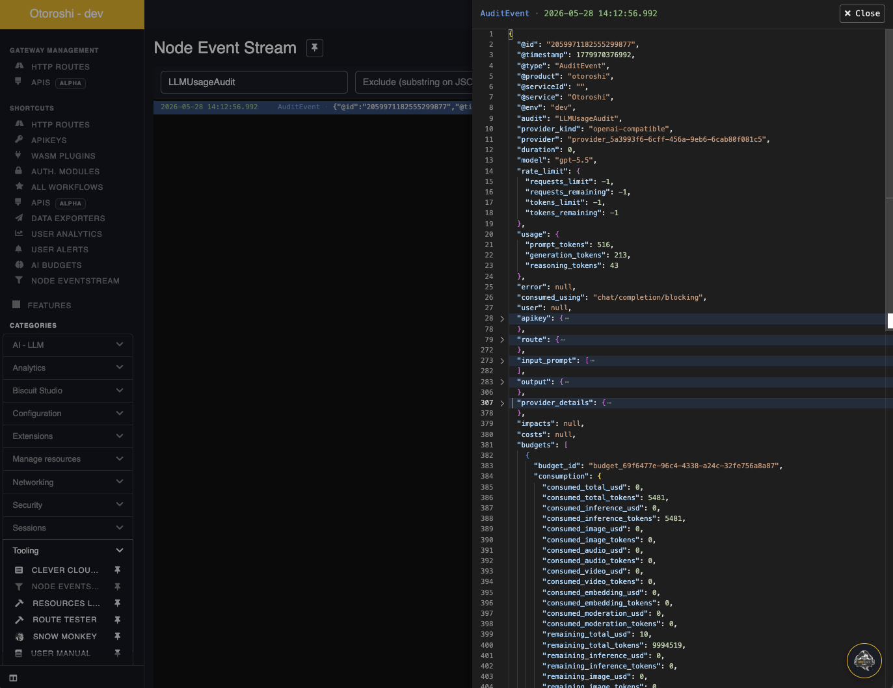

Vous pouvez filtrer le flux par type (`AuditEvent`, `WorkflowRunEvent`, `GatewayEvent`, etc.) et inspecter chaque événement individuellement.

> 💡 **Astuce** : pour ne voir que les appels LLM (prompt, réponse, tokens consommés, coût estimé, provider appelé…), filtrez sur le type **`LLMUsageAudit`**. C'est l'événement d'audit dédié émis par la LLM extension à chaque appel d'un provider IA — pratique pour valider en live ce qui sort de votre agent.

> ℹ️ La démo détaillée tracing / audit / Grafana n'est pas obligatoire pendant le workshop : mentionnez-la comme **capacité disponible** plutôt que comme étape à faire.

## Étape 2.7 — Guardrails LLM

Sur le provider `IANA Clever AI`, descendez jusqu'à la section **Guardrails validation** et ajoutez un guardrail. Plusieurs types sont disponibles : modération de langue, regex, listes noires, etc.

### Pré-requis : un second provider pour la modération

Le guardrail **`Language moderation`** s'appuie sur un **LLM tiers** pour classer le contenu (hate, harassment, etc.). Il faut donc **créer un second provider IA** dédié à cette classification, en suivant la même procédure que l'[Étape 1.1](#étape-11--créer-le-provider-ia-clever-ai), avec deux différences importantes :

- ce second provider **ne doit pas avoir de guardrail** configuré (sous peine d'avoir une boucle infinie : guardrail → provider de modération → guardrail → …) ;
- vous pouvez le pointer sur le même endpoint Clever AI ou sur tout autre provider compatible.

Nommez-le par exemple `IANA Clever AI - Moderation` pour le distinguer du provider principal.

### Configuration du guardrail

Une fois le second provider créé, retournez sur le provider `IANA Clever AI` et ajoutez le guardrail :

- **Guardrail** : `Language moderation`
- **Apply before** : ✅ (avant l'appel au LLM)
- **Apply after** : ✅ (sur la réponse du LLM)
- **LLM Provider** : le **second provider** dédié à la modération
- **Moderation types** : `hate`, `harassment`, `self-harm`, `sexual`, `violence`, etc.

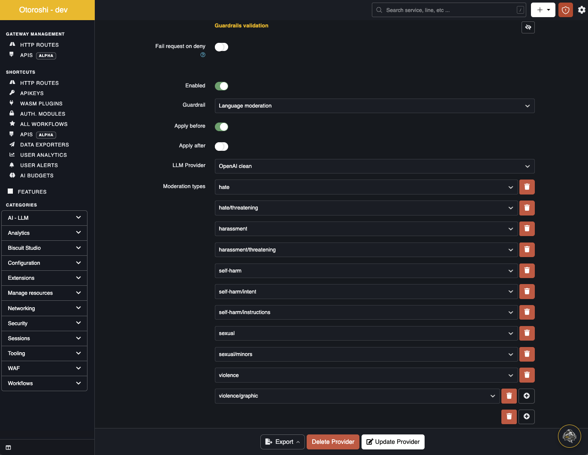

> 💡 Activez **Fail request on deny** pour bloquer l'appel en cas de détection plutôt que de simplement annoter.

---

# Niveau 3 — Agent multi-MCP

**Objectif** : composer un agent qui orchestre **plusieurs sources MCP** :

- **MCP RAG** : couverture contractuelle ;
- **MCP Risques majeurs** : risques naturels associés à une adresse ;
- **MCP DevQuest** : informations sur les speakers (ville, etc.).

## Étape 3.1 — Connecteur MCP Risques majeurs

> `Sidebar ▸ Categories ▸ AI - LLM ▸ MCP Connectors ▸ Add item`

| Champ | Valeur |
| --- | --- |
| **Name** | `IANA Risques majeurs` |
| **Enabled** | ✅ |
| **Transport kind** | `HTTP` |
| **URL** | `https://risques-majeurs-mcp.serliapps.dev/mcp` |

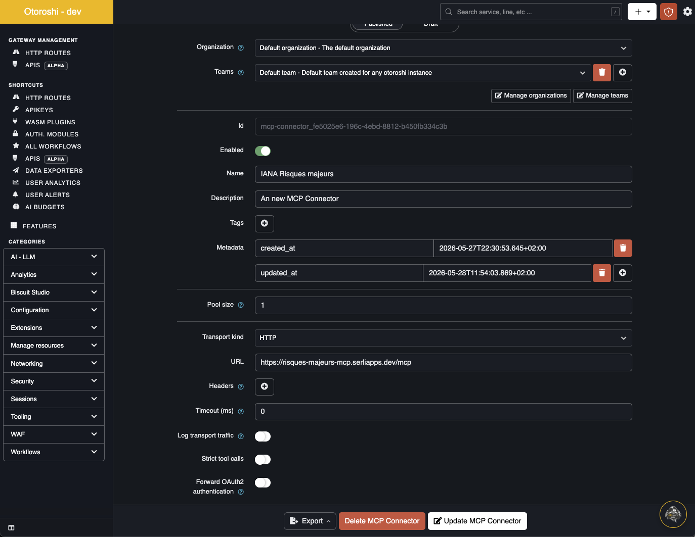

## Étape 3.2 — Workflow Risques + RAG

Créez un nouveau workflow **`IANA Risques + RAG`** avec :

- un nœud `AI Agent` ;
- **deux** nœuds `MCP Tools` raccrochés à l'agent : un pour `IANA RAG`, un pour `IANA Risques majeurs` ;
- un nœud `HTTP client` qui transforme le rapport markdown produit par l'agent en **PDF** ;
- un nœud `Returned` qui renvoie à la fois le rapport et le lien vers le PDF.

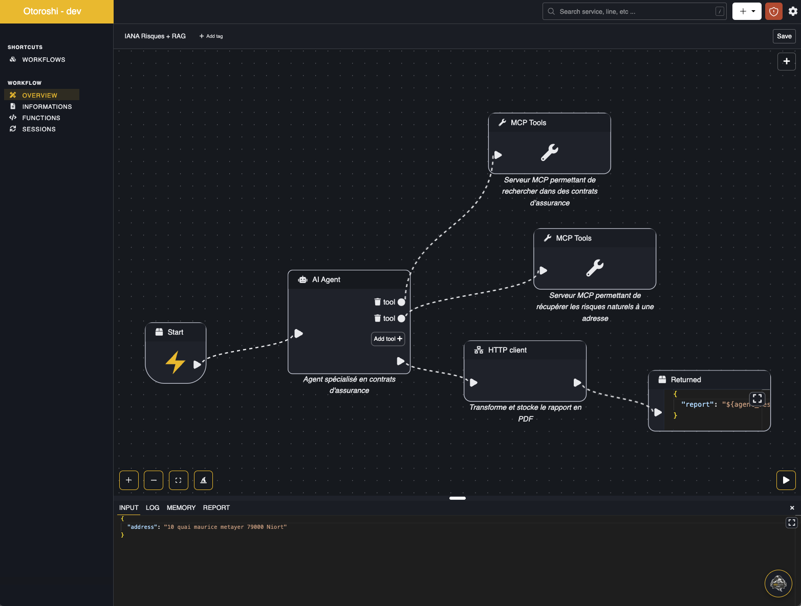

### Configuration de l'`AI Agent`

- **LLM provider** : `IANA Clever AI`
- **Instructions** :
  ```
  Tu es un agent spécialisé dans l'analyse de contrats d'assurance et les risques naturels.
  Tu as a ta disposition un connecteur MCP pour chercher dans des contrats d'assurance.
  Tu as a ta disposition un connecteur MCP permettant de récupérer les risques naturels à une adresse.

  Tu vas répondre aux questions de l'utilisateurs sur ses contrats et les risques naturels
  ```
- **Agent input** :
  ```
  Quels sont les risques naturels à mon adresse et en quoi suis-je couvert par mon assurance ?

  Voici mon adresse :

  ${workflow_input.address || workflow_input.request.body_json.address}
  ```

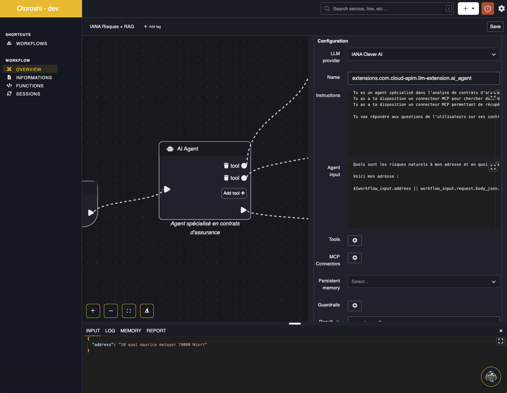

### Configuration des nœuds `MCP Tools`

Un nœud pointe sur `IANA RAG` (contrats), l'autre sur `IANA Risques majeurs` (risques naturels) :

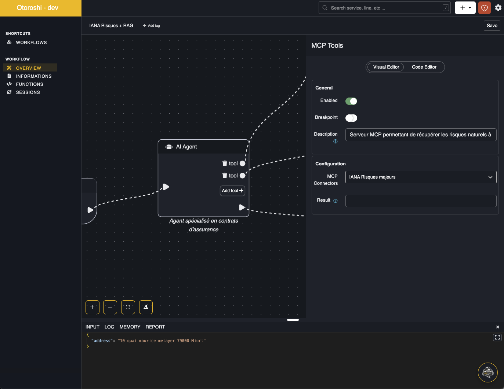

### Configuration du nœud `HTTP client` (markdown → PDF)

Après l'agent, on ajoute un nœud `HTTP client` (catégorie `Networking`) qui prend le rapport markdown produit par l'agent et appelle un service de conversion PDF. Le lien public vers le PDF généré est ensuite remonté dans le résultat du workflow.

- **URL** : `https://md-to-pdf-iana.cleverapps.io/convert-and-store`
- **Method** : `POST`
- **Headers** : `Content-Type: application/json`
- **Body** :
  ```json
  { "markdown": "${agent_result}" }
  ```
- **Response selector** : `body_json.url`
- **Result** : `pdf_link`

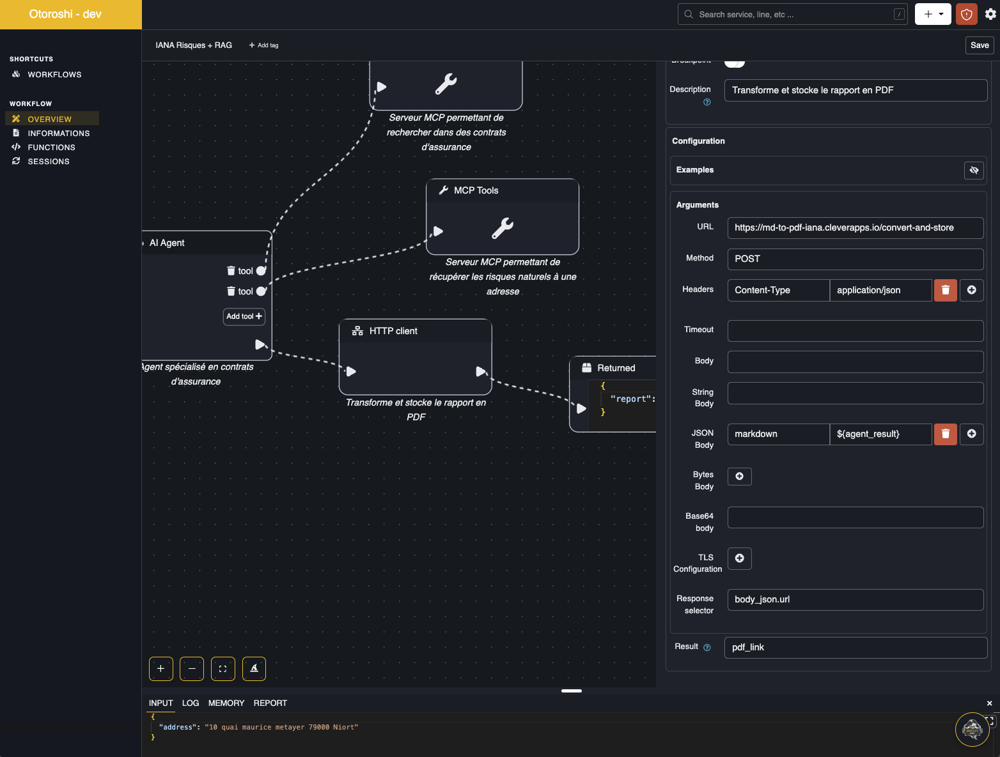

### Configuration du nœud `Returned`

Mettez à jour le nœud `Returned` pour renvoyer **à la fois** le rapport markdown et le lien vers le PDF généré :

```json
{
  "pdf_link": "${pdf_link}",
  "report": "${agent_result}"
}
```

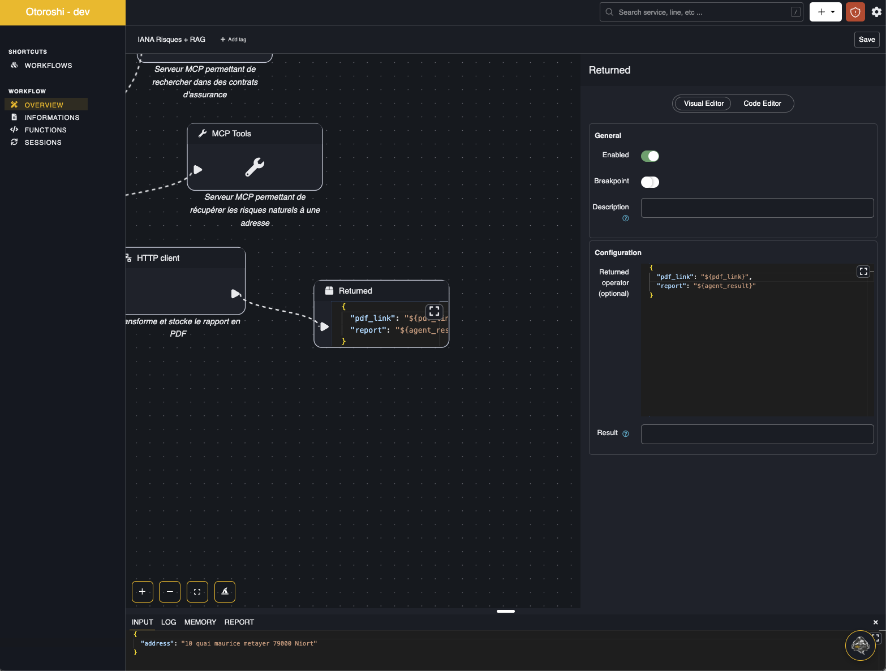

### Test

Dans le panneau **INPUT** :

```json
{
  "address": "10 quai maurice metayer 79000 Niort"
}
```

L'agent doit :

1. interroger le MCP Risques majeurs pour récupérer les risques associés à l'adresse ;
2. interroger le MCP RAG pour vérifier la couverture contractuelle ;
3. produire un rapport markdown croisé ;
4. convertir ce rapport en PDF via le nœud `HTTP client` ;
5. retourner le rapport **et** le lien vers le PDF.

## Étape 3.3 — Connecteur MCP DevQuest

> `Sidebar ▸ Categories ▸ AI - LLM ▸ MCP Connectors ▸ Add item`

| Champ | Valeur |
| --- | --- |
| **Name** | `IANA DevQuest` |
| **Enabled** | ✅ |
| **Transport kind** | `HTTP` |
| **URL** | `https://devquest-mcp-serli.serliapps.dev/mcp` |

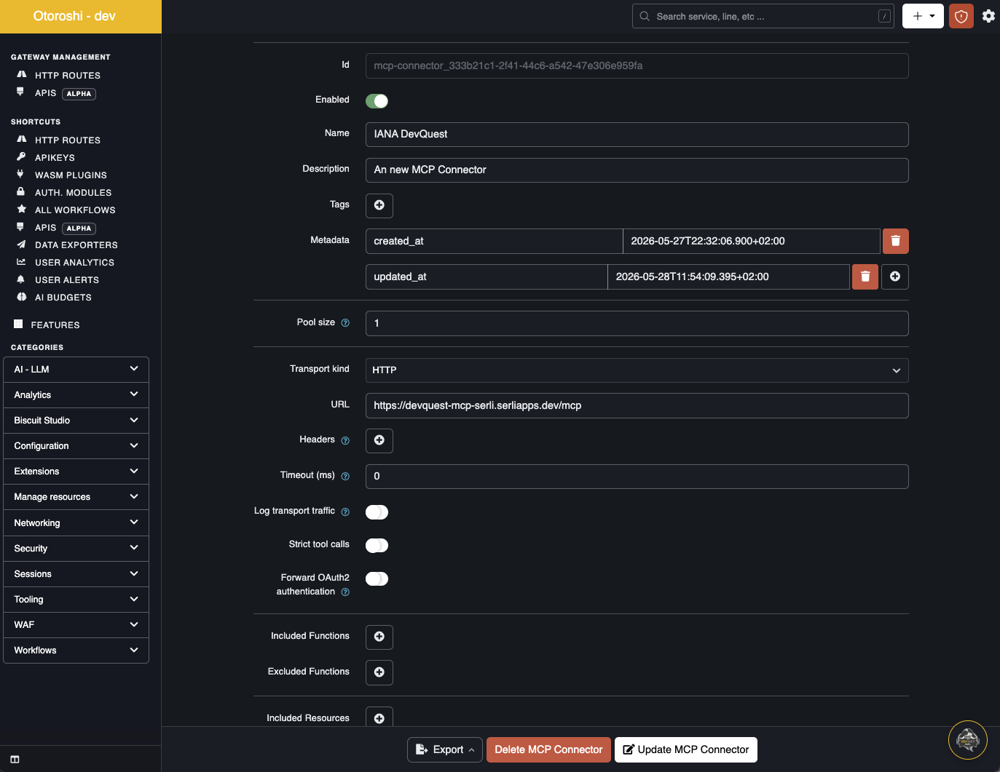

## Étape 3.4 — Workflow DevQuest + Risques + RAG

Créez un nouveau workflow **`IANA DevQuest + Risques + RAG`** avec **trois** nœuds `MCP Tools` raccrochés à l'`AI Agent` :

- `IANA RAG` ;
- `IANA Risques majeurs` ;
- `IANA DevQuest`.

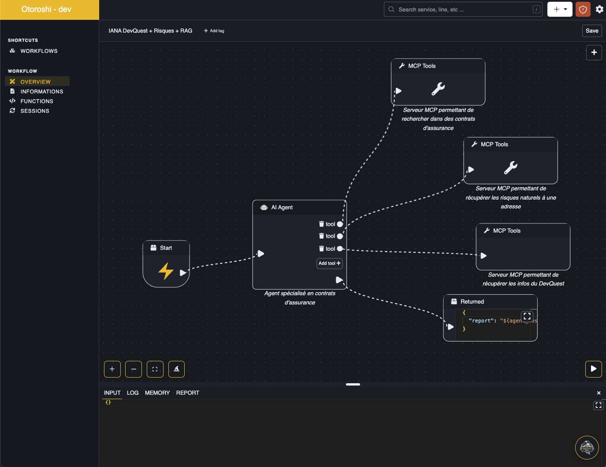

### Configuration de l'`AI Agent`

- **LLM provider** : `IANA Clever AI`
- **Instructions** :
  ```
  Tu es un agent spécialisé dans l'analyse de contrats d'assurance et les risques naturels.
  Tu as a ta disposition un connecteur MCP pour chercher dans des contrats d'assurance.
  Tu as a ta disposition un connecteur MCP permettant de récupérer les risques naturels à une adresse.
  Tu as a ta disposition un connecteur MCP permettant de récupérer les infos sur le DevQuest

  Tu vas répondre aux questions de l'utilisateurs sur ses contrats et les risques naturels et le devquest
  ```
- **Agent input** :
  ```
  Quels sont les risques naturels à l'adresse de chaque speaker du devquest et en quoi suis-je couvert par mon assurance ?
  ```

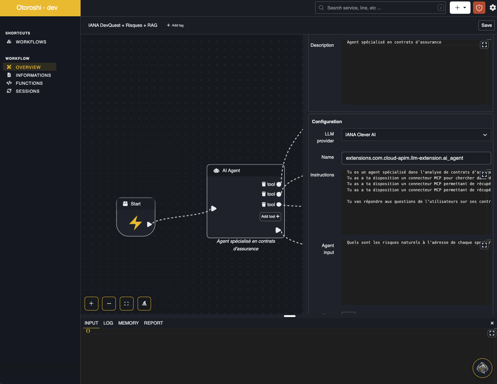
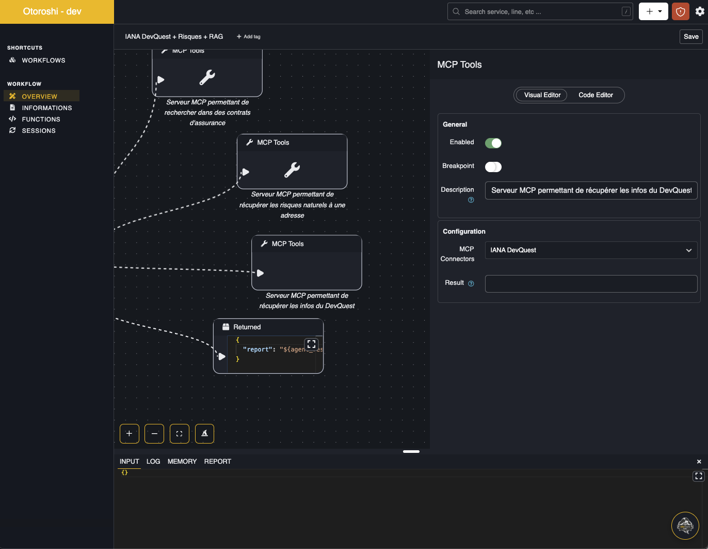

### Test

Pas besoin d'input particulier — la question est portée par les instructions de l'agent. À l'exécution, l'agent doit :

1. appeler **DevQuest** pour récupérer la liste des speakers et leur ville associée ;
2. pour chaque ville, appeler **Risques majeurs** ;
3. interroger le **MCP RAG** pour vérifier la couverture contractuelle ;
4. produire un rapport consolidé.

---

## Manifests fournis

Le dossier [`./manifests`](./manifests) contient les **définitions JSON exportables** de toutes les entités créées dans ce guide. Vous pouvez les charger en une fois via le **Resources Loader** d'Otoroshi :

> `Sidebar ▸ Categories ▸ Tooling ▸ Resources Loader`
>
> URL : `<URL-backoffice-otoroshi>/bo/dashboard/resources-loader`

Collez-y le contenu d'un ou plusieurs manifests, puis validez l'import.

| Fichier | Entité |
| --- | --- |
| `provider-iana-clever-ai.json` | Provider IA Clever AI |
| `mcp-connector-rag.json` | Connecteur MCP RAG |
| `mcp-connector-iana-risques-majeurs.json` | Connecteur MCP Risques majeurs |
| `workflow-rag-simple.json` | Workflow Niveau 1 |
| `workflow-iana-risques-rag.json` | Workflow Niveau 3 (Risques + RAG) |
| `workflow-iana-devquest-risques-rag.json` | Workflow Niveau 3 complet |
| `route-rag-simple-api.json` | Route d'exposition API REST |
| `route-rag-simple-mcp.json` | Route d'exposition MCP |
| `function-rag-simple.json` | Tool Function `get_insurance_report` |
| `bugdet-provider.json` | Budget IA par provider |
| `budget-apikey.json` | Budget IA par API key |

> ⚠️ Pensez à adapter les IDs, les domaines (`${slug}`) et les références (`auth_module_ref`, etc.) à votre instance avant import.

---

## Liens utiles

- **Otoroshi** — [otoroshi.io](https://www.otoroshi.io/) · [Documentation](https://maif.github.io/otoroshi/manual/) · [GitHub MAIF/otoroshi](https://github.com/MAIF/otoroshi)
- **Otoroshi LLM Extension** — [Documentation Cloud APIM](https://cloud-apim.github.io/otoroshi-llm-extension/) · [Install guide](https://cloud-apim.github.io/otoroshi-llm-extension/docs/install) · [GitHub](https://github.com/cloud-apim/otoroshi-llm-extension)
- **Clever Cloud** — [clever.cloud](https://www.clever.cloud/) · [Clever AI](https://www.clever.cloud/clever-ai/)
- **n8n** — [n8n.io](https://n8n.io/)
- **Model Context Protocol** — [modelcontextprotocol.io](https://modelcontextprotocol.io/) · [MCP Inspector](https://github.com/modelcontextprotocol/inspector)

---

## Récap des URLs du backoffice Otoroshi

Toutes les URLs ci-dessous sont à préfixer par votre `<URL-backoffice-otoroshi>` :

- **Providers IA** : `/bo/dashboard/extensions/cloud-apim/ai-gateway/providers`
- **MCP Connectors** : `/bo/dashboard/extensions/cloud-apim/ai-gateway/mcp-connectors`
- **Tool Functions** : `/bo/dashboard/extensions/cloud-apim/ai-gateway/tool-functions`
- **AI Budgets** : `/bo/dashboard/extensions/cloud-apim/ai-gateway/ai-budgets`
- **Workflows** : `/bo/dashboard/extensions/workflows/workflows`
- **Routes** : `/bo/dashboard/routes`
- **API Keys** : `/bo/dashboard/apikeys`
- **Events** : `/bo/dashboard/node/eventstream`
